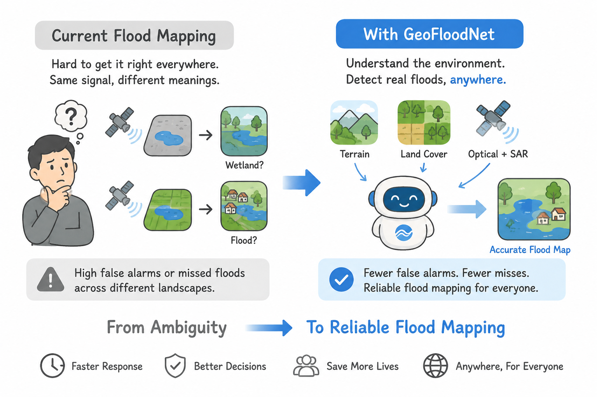

> 🚧 **Online Platform:** The GeoFloodNet online flood monitoring platform is currently under development and will be released soon.

# GeoFloodNet

### Toward Rapid Flood Mapping Anywhere via Terrain- and Land-Cover-Conditioned Optical–SAR Fusion

**GeoFloodNet** is a geographically conditioned cross-modal framework for rapid **event-induced flood inundation mapping** from pre-event Sentinel-2 optical imagery and post-event Sentinel-1 SAR imagery.

The key idea is simple: **flood evidence is not geographically invariant**. Similar optical–SAR discrepancies may indicate true inundation in low-lying cropland, but may also arise from wetlands, permanent water, terrain shadow, smooth artificial surfaces, or other flood-like background conditions. GeoFloodNet therefore interprets optical–SAR evidence jointly with local **terrain** and **land-cover** context rather than treating cross-modal differences as universally valid flood cues.

<p align="center">
  
</p>

---

## Highlights

- **GeoFloodNet** — a terrain- and land-cover-conditioned optical–SAR fusion framework for rapid flood inundation mapping.
- **GeoFlood-275** — a global event-level benchmark containing 275 flood event–AOI pairs and 133,555 image patches.
- **Geographic conditioning** — terrain and land-cover priors are used to modulate feature extraction, estimate modality reliability, regulate cross-modal fusion, and suppress flood-like background responses.
- **Official training and evaluation code** — including GeoTIFF data loading, normalization, training, testing, metrics, prediction masks, and visualization.
- **Online flood monitoring platform** — an upcoming interface for AOI upload, Sentinel-1/2 observation retrieval, online flood extraction, visualization, and result download.

---

## Motivation

Rapid flood mapping requires both timely satellite observations and reliable interpretation across heterogeneous geographic environments. Pre-event optical imagery provides detailed land-surface context, while post-event SAR imagery offers all-weather observations during or immediately after a flood event.

However, optical–SAR discrepancies do not have fixed flood semantics across regions. For example, low SAR backscatter may indicate newly inundated cropland in one location, while a similar response elsewhere may correspond to permanent water, wetland, wet soil, smooth built-up surfaces, or terrain-related effects.

GeoFloodNet formulates rapid flood mapping as a **terrain- and land-cover-conditioned inference problem** rather than a simple cross-modal change detection task. Instead of asking only whether the pre-event optical image and post-event SAR image are different, GeoFloodNet asks:

> **Is the observed optical–SAR evidence flood-relevant under the local terrain and land-cover context?**

---

## GeoFloodNet

GeoFloodNet uses the following inputs:

| Input | Role |
| --- | --- |
| **Pre-event Sentinel-2** | Provides land-surface semantics and background context before the flood event. |
| **Post-event Sentinel-1** | Provides all-weather crisis-time evidence of flood-related surface responses. |
| **Slope** | Provides terrain constraints for flood plausibility. |
| **ESA WorldCover v200** | Provides stable global land-cover semantics. |
| **Dynamic World NRT** | Provides event-adjacent land-cover context. |

Unlike simple channel concatenation, GeoFloodNet explicitly uses terrain and land-cover priors to condition the interpretation of optical–SAR evidence. These geographic priors are used to:

- modulate modality-specific optical and SAR features;
- estimate local modality reliability;
- regulate cross-modal fusion;
- suppress flood-like background responses in complex environments.

This design allows similar optical–SAR patterns to be interpreted differently under different geographic settings.

---

## GeoFlood-275 Benchmark

**GeoFlood-275** is a global event-level benchmark designed for geographically conditioned rapid flood inundation mapping.

### Data Components

Each event–AOI pair contains:

| Component | Description |
| --- | --- |
| Pre-event optical image | Sentinel-2 RGB + NIR |
| Post-event SAR image | Sentinel-1 VV + VH |
| Reference map | EMSR-derived event-induced inundation |
| Terrain prior | Slope derived from Copernicus DEM |
| Stable land-cover prior | ESA WorldCover v200 |
| Event-adjacent land-cover prior | Dynamic World NRT |
| Spatial resolution | 10 m |
| Patch size | 512 × 512 |

### Dataset Statistics

| Split | Events | Samples | Protocol |
| --- | ---: | ---: | --- |
| Train | 234 | 125,552 | Historical flood events |
| Validation | 20 | 4,476 | Temporally separated events |
| Test | 21 | 3,527 | Temporally separated events |
| **Total** | **275** | **133,555** | Global event-level benchmark |

> **Label definition:** the reference masks represent **event-induced inundation**, rather than generic surface water. Permanent and background water bodies are excluded under the adopted reference definition.

### Download

The benchmark is publicly available on Hugging Face:

**[GeoFlood-275 on Hugging Face](https://huggingface.co/datasets/jiepanli/GeoFlood-275)**

---

## Repository Structure

```text
network/
  GeoFloodNet.py        # GeoFloodNet model
utils/
  dataloader.py         # Main GeoFlood-275 GeoTIFF dataloader
  dataload_v2.py        # Optional extended dataloader for extra products
  utils.py              # Training helpers
train.py                # Training entry point
test.py                 # Validation/test evaluation and visualization
```

---

## Dataset Structure

`train.py` and `test.py` expect the GeoTIFF dataset root to contain `Train`, `Val`, and `Test` directories:

```text
Benchmark_all/
├── Train/
│   ├── Sentinel-2/
│   ├── Sentinel-1/
│   ├── CD_Flood/
│   ├── DEM/
│   ├── ESAV200/
│   ├── Dynamic_Landcover/
│   └── Slope_Norm/
├── Val/
│   └── ...
└── Test/
    └── ...
```

### Input Normalization

The released GeoTIFF files are **not** stored as pre-normalized training tensors. Normalization is performed online by `utils/dataloader.py`:

| Data | Preprocessing |
| --- | --- |
| Sentinel-1 | Clip to `[-45, 25]` dB and map to `[-1, 1]` |
| Sentinel-2 | Clip to `[0, 6000]` and map to `[-1, 1]` |
| DEM | Scale by `/5000` and standardize |
| Slope | Clip to `[0, 1]` |
| ESA WorldCover | Remap classes to contiguous IDs |
| Dynamic World | Keep integer class labels |
| Flood mask | Map to `{0, 1}` when needed |

---

## Installation

Install PyTorch according to your CUDA environment, then install the remaining dependencies:

```bash
python -m pip install -r requirements.txt
```

---

## Pretrained Models

| Model | Download |
| --- | --- |
| Pretrained Sentinel-1 encoder | [Google Drive](https://drive.google.com/file/d/1cxNs0zVH6hx9Q2QcBizjV8tyE_NdrLyq/view?usp=sharing) |
| Pretrained Sentinel-2 encoder | [Google Drive](https://drive.google.com/file/d/178Qhyp2EFwpK4JWIzuimYL5nO7qZquPH/view?usp=sharing) |
| Trained GeoFloodNet model | [Google Drive](https://drive.google.com/file/d/1K45JaW4vxwptWe6JAml2kaFlUjWSYQFh/view?usp=sharing) |

---

## Training

```bash
CUDA_VISIBLE_DEVICES=0 python train.py \
  --dataset_root /path/to/GeoFlood-275/Benchmark_all \
  --pre_s1 path \
  --pre_s2 path \
  --save_path ./Experiments/GeoFloodNet \
  --batchsize 8 \
  --amp
```

---

## Evaluation

```bash
CUDA_VISIBLE_DEVICES=0 python test.py \
  --model floodnet \
  --psdp_mix \
  --dataset_root /path/to/GeoFlood-275/Benchmark_all \
  --load ./Experiments/GeoFloodNet/Val_best.pth \
  --batchsize 4 \
  --amp
```

By default, evaluation outputs are written under the checkpoint directory and include:

- per-split evaluation metrics;
- confusion matrices;
- predicted flood masks;
- visualization results.

Use `--output_dir` to specify a custom output directory when needed.

---

## Online Flood Monitoring Platform

The GeoFloodNet online platform is being developed to make rapid flood mapping accessible without requiring users to manually download, preprocess, and align multi-source remote-sensing data.

The planned workflow is:

| Step | Operation | Description |
| ---: | --- | --- |
| 1 | **Upload AOI** | Upload a target area using GeoJSON or Shapefile. |
| 2 | **Select time range** | Specify the monitoring period for the target flood event. |
| 3 | **Retrieve observations** | Automatically search available Sentinel-1 and Sentinel-2 observations. |
| 4 | **Prepare geographic context** | Automatically prepare terrain and land-cover information. |
| 5 | **Select image pair** | Select suitable pre-event optical and post-event SAR observations. |
| 6 | **Run flood extraction** | Perform geographically conditioned optical–SAR inference with GeoFloodNet. |
| 7 | **Export results** | Visualize and download the generated flood inundation map and associated outputs. |

The platform will be made publicly accessible after finalization.

---

## Citation

If you find GeoFloodNet or GeoFlood-275 useful in your research, please cite:

```bibtex
@misc{li2026geoflood275,
  title  = {Toward Rapid Flood Mapping Anywhere via Terrain- and Land-Cover-Conditioned Optical-SAR Fusion},
  author = {Li, Jiepan and Huang, He and Li, Wenke and Li, Linxin and Xie, Anqi and Ye, Ruoru and Hu, Lei and Hu, Ting and He, Wei and Zhang, Liangpei},
  year   = {2026},
  note   = {Manuscript under revision for Remote Sensing of Environment}
}
```

---

## Status

- ✅ GeoFloodNet training and evaluation code released
- ✅ GeoFlood-275 benchmark released on Hugging Face
- 🚧 Online flood monitoring platform under development
- 📝 Associated manuscript under peer review

---

## Contact

For questions, collaborations, or platform updates, please open an issue in this repository.
